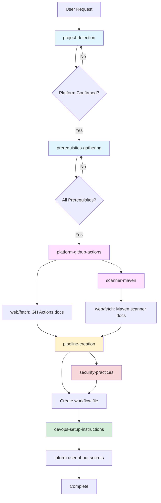

# SonarArchitectLight Workflow Example

This document demonstrates a complete workflow of the SonarArchitectLight agent setting up SonarQube integration for a Maven project with GitHub Actions and SonarQube Cloud.

## Scenario Overview

- **Project Type**: Maven
- **CI/CD Platform**: GitHub Actions
- **SonarQube Type**: Cloud
- **Organization**: my-org
- **Instance**: EU (sonarcloud.io)
- **Current Branch**: feature/analytics

---

## Workflow Steps

### Step 1: User Request

```
User: "Set up SonarQube for my project"
```

---

### Step 2: Project Detection

**Skill Used:** `project-detection`

**Actions Performed:**
- Search and read workspace files
- Detected: `pom.xml` → Maven project ✓
- Detected: `.github/workflows/ci.yml` → GitHub Actions ✓
- Checked: No `.gitlab-ci.yml`, `azure-pipelines.yml`, `bitbucket-pipelines.yml`
- Checked: No existing SonarQube configuration

**Agent Response:**
```
I detected a Maven project with GitHub Actions (found .github/workflows/ directory).
Is this correct, or would you like to use a different CI/CD platform?
```

---

### Step 3: Platform Confirmation

```
User: "That's correct"
```

---

### Step 4: Prerequisites Gathering

**Skill Used:** `prerequisites-gathering`

**Actions Performed:**
- Execute: `git rev-parse --abbrev-ref HEAD` → "feature/analytics"
- Identified prerequisites needed from user:
  - SonarQube type (Cloud/Server)
  - Project key
  - Organization (if Cloud)
  - Instance URL (if Cloud)

**Agent Response:**
```
I need some information to set up your SonarQube analysis:
- Are you using SonarQube Cloud or Server?
- What is your SonarQube project key?
- What is your organization key?
- Which instance? (US: sonarqube.us or EU: sonarcloud.io)
```

---

### Step 5: User Provides Prerequisites

```
User: "Cloud, my-org_my-project, my-org, EU"
```

**Prerequisites Collected:**
| Prerequisite | Value | Source |
|--------------|-------|--------|
| SonarQube Type | Cloud | User provided |
| CI/CD Platform | GitHub Actions | Detected |
| Project Key | my-org_my-project | User provided |
| Organization | my-org | User provided |
| Instance | sonarcloud.io | User provided (EU) |
| Current Branch | feature/analytics | Git command |
| Build System | Maven | Detected (pom.xml) |

✅ **All prerequisites confirmed - Ready to proceed**

---

### Step 6: Fetch Latest SonarQube Examples

**Skills Used:** `platform-github-actions` + `scanner-maven`

**Actions Performed:**

1. **Fetch GitHub Actions SonarQube Documentation:**
   ```
   web/fetch: https://docs.sonarsource.com/sonarqube-cloud/advanced-setup/ci-based-analysis/github-actions-for-sonarcloud
   ```
   **Extracted:**
   - Latest GitHub Actions versions: `actions/checkout@v4`, `actions/setup-java@v4`
   - Maven execution pattern for SonarQube
   - Caching configuration

2. **Fetch Maven Scanner Documentation:**
   ```
   web/fetch: https://docs.sonarsource.com/sonarqube-cloud/advanced-setup/ci-based-analysis/sonarqube-scanner-for-maven
   ```
   **Extracted:**
   - Latest Maven plugin version: `org.sonarsource.scanner.maven:sonar-maven-plugin:4.0.0.4121`
   - Configuration patterns
   - Command-line parameter format

**Key Decision from scanner-maven skill:**
- Maven projects run scanner via `mvn sonar:sonar` command
- **No** `sonarqube-scan-action` needed (that's only for CLI scanner projects)
- Configuration can be in `pom.xml` or command-line parameters

---

### Step 7: Check Existing Maven Configuration

**Skill Used:** `scanner-maven`

**Actions Performed:**
- Read: `pom.xml` (complete file)
- Check: Does `pom.xml` have `sonar-maven-plugin`?
  - Result: No plugin found
- Decision: Plugin is optional (can be added but not required)

---

### Step 8: Create Configuration Files

**Skills Applied:** `pipeline-creation` + `security-practices` + `scanner-maven` + `platform-github-actions`

#### File Created: `.github/workflows/sonarqube.yml`

**Skills Applied in This File:**

| Line/Section | Skill | Rule Applied |
|--------------|-------|--------------|
| `on.push.branches` | `prerequisites-gathering` + `pipeline-creation` | Include current branch (feature/analytics) if not main/master |
| `fetch-depth: 0` | `pipeline-creation` | Full git history for accurate blame |
| `actions/checkout@v4` | `platform-github-actions` | Latest action version from docs |
| `actions/setup-java@v4` | `platform-github-actions` | Latest action version |
| `cache: 'maven'` | `platform-github-actions` | Maven dependency caching |
| `~/.sonar/cache` | `platform-github-actions` | SonarQube scanner caching |
| `${{ secrets.SONAR_TOKEN }}` | `security-practices` | Never hardcode tokens, use secrets |
| `mvn sonar:sonar` | `scanner-maven` | Maven scanner execution command |
| `-Dsonar.projectKey=` | `scanner-maven` | Maven command-line parameters |
| Job name: "SonarQube Analysis" | `pipeline-creation` | Consistent naming (works for Cloud/Server) |

**Generated File:**

```yaml
name: SonarQube Analysis
on:
  push:
    branches:
      - main
      - feature/analytics  # Current branch included
  pull_request:
    types: [opened, synchronize, reopened]

jobs:
  sonarqube:
    name: SonarQube Analysis
    runs-on: ubuntu-latest
    
    steps:
      - name: Checkout code
        uses: actions/checkout@v4
        with:
          fetch-depth: 0  # Full git history for blame information
      
      - name: Set up JDK 17
        uses: actions/setup-java@v4
        with:
          distribution: 'temurin'
          java-version: 17
          cache: 'maven'  # Cache Maven dependencies
      
      - name: Cache SonarQube packages
        uses: actions/cache@v4
        with:
          path: ~/.sonar/cache
          key: ${{ runner.os }}-sonar
          restore-keys: ${{ runner.os }}-sonar
      
      - name: Run SonarQube Analysis
        env:
          SONAR_TOKEN: ${{ secrets.SONAR_TOKEN }}  # Security: Use GitHub secret
        run: |
          mvn -B verify sonar:sonar \
            -Dsonar.projectKey=my-org_my-project \
            -Dsonar.organization=my-org \
            -Dsonar.host.url=https://sonarcloud.io
```

---

### Step 9: Inform About DevOps Setup

**Skills Used:** `devops-setup-instructions` + `security-practices` + `platform-github-actions`

**Agent Response:**

```
✅ Created .github/workflows/sonarqube.yml

🔐 Next Steps - Configure GitHub Secret:

1. Go to: Repository → Settings → Secrets and variables → Actions
2. Click "New repository secret"
3. Add secret:
   Name: SONAR_TOKEN
   Value: [Generate token at https://sonarcloud.io/account/security]

The workflow will run on pushes to main and feature/analytics branches,
and on pull requests.
```

**Skills Applied:**
- `platform-github-actions`: GitHub-specific secret location
- `security-practices`: Token generation location and best practices
- `devops-setup-instructions`: Concise setup steps format

---

## Skills Cross-Reference Matrix

| Step | Primary Skill(s) | Supporting Skills | Action Taken |
|------|------------------|-------------------|--------------|
| 2 | `project-detection` | - | Detect Maven + GitHub Actions |
| 4 | `prerequisites-gathering` | - | Collect all required info |
| 6 | `platform-github-actions`<br>`scanner-maven` | `pipeline-creation` | Fetch latest versions & patterns |
| 7 | `scanner-maven` | - | Verify existing Maven config |
| 8 | `pipeline-creation` | `security-practices`<br>`scanner-maven`<br>`platform-github-actions` | Create workflow file |
| 9 | `devops-setup-instructions` | `security-practices`<br>`platform-github-actions` | Provide setup instructions |

---

## Key Decision Points Explained

### 1. Why No `sonarqube-scan-action`?

**Skill Reference:** `pipeline-creation` → Scanner Selection Rules

**Decision Logic:**
- Maven projects use their own SonarQube plugin
- Scanner runs via `mvn sonar:sonar` command
- The `sonarqube-scan-action` is ONLY for CLI scanner projects:
  - JavaScript/TypeScript
  - Python
  - PHP, Go, Ruby, etc.
  - Projects using `sonar-project.properties`

**From scanner-maven skill:**
- Maven executes analysis through Maven lifecycle
- Configuration via command-line parameters or `pom.xml`
- No separate scanner needed

---

### 2. Why Include `feature/analytics` Branch?

**Skill Reference:** `prerequisites-gathering` + `pipeline-creation`

**Decision Logic:**
- Current branch detected: `feature/analytics`
- Rule: Include current branch in triggers if not `main` or `master`
- Purpose: Allow analysis to run immediately without switching branches

**Detected via:**
```bash
git rev-parse --abbrev-ref HEAD
# Output: feature/analytics
```

---

### 3. Why Use GitHub Secrets Syntax?

**Skill Reference:** `security-practices` + `platform-github-actions`

**Decision Logic:**
- `security-practices` rule: NEVER hardcode credentials
- `platform-github-actions` provides syntax: `${{ secrets.SONAR_TOKEN }}`
- Each platform has different syntax:
  - GitHub Actions: `${{ secrets.* }}`
  - GitLab CI: `$VARIABLE_NAME`
  - Azure DevOps: `$(VARIABLE_NAME)`
  - Bitbucket: `$VARIABLE_NAME`

---

### 4. Why Fetch from docs.sonarsource.com?

**Skill Reference:** `pipeline-creation` → Fetch Latest Versions

**Decision Logic:**
- ALWAYS use `web/fetch` to get current documentation
- Rule: "DO NOT guess or use outdated versions"
- Ensures:
  - Latest action versions (`@v4` not `@v3`)
  - Latest plugin versions
  - Current best practices
  - Official configuration patterns

**What NOT to fetch:**
- Gradle build configuration (assume working build exists)
- Maven project setup (assume working build exists)
- .NET build configuration (assume working build exists)
- **Only fetch SonarQube-specific documentation**

---

### 5. Why Job Name "SonarQube Analysis"?

**Skill Reference:** `pipeline-creation`

**Decision Logic:**
- Generic name works for both SonarQube Cloud AND Server
- Avoids confusion if switching between Cloud/Server
- Consistent naming across all platforms
- Clear indication of purpose

---

## Complete Skills Interaction Flow



### Legend:
- 🔹 **Blue**: Detection & Prerequisites
- 🔸 **Pink**: Platform & Scanner specific
- 🟡 **Yellow**: Pipeline creation
- 🔴 **Red**: Security
- 🟢 **Green**: DevOps instructions

---

## Workflow Result

### Files Created/Modified:

1. **`.github/workflows/sonarqube.yml`** ✅ Created
   - Configured for SonarQube Cloud
   - Uses secrets for credentials
   - Includes current branch in triggers
   - Proper caching configured
   - Maven-specific execution

### User Actions Required:

1. **Add GitHub Secret:**
   - Navigate to: Repository → Settings → Secrets and variables → Actions
   - Create secret: `SONAR_TOKEN`
   - Value: Token from SonarQube Cloud

2. **Commit and Push:**
   - Commit the new workflow file
   - Push to `feature/analytics` or `main`
   - Workflow will run automatically

### Expected Behavior:

- ✅ Workflow runs on push to `main` or `feature/analytics`
- ✅ Workflow runs on pull requests
- ✅ SonarQube analysis executed via Maven
- ✅ Results published to SonarQube Cloud
- ✅ Quality gate status visible in GitHub

---

## Alternative Scenarios

### Scenario: Gradle + GitLab CI + SonarQube Server

**Skills Workflow Changes:**
- `project-detection`: Detects `build.gradle` + `.gitlab-ci.yml`
- `platform-gitlab-ci`: Uses Docker images, CI/CD variables syntax
- `scanner-gradle`: Uses `./gradlew sonar` command
- `security-practices`: GitLab variables syntax `$SONAR_TOKEN`

### Scenario: JavaScript + Azure DevOps + SonarQube Cloud

**Skills Workflow Changes:**
- `project-detection`: Detects `package.json` + `azure-pipelines.yml`
- `platform-azure-devops`: Uses SonarQube extension tasks
- `scanner-cli`: Uses CLI scanner (requires `sonar-project.properties`)
- Need: `SonarQubePrepare` + `SonarQubeAnalyze` + `SonarQubePublish` tasks

### Scenario: .NET + Bitbucket + SonarQube Server

**Skills Workflow Changes:**
- `project-detection`: Detects `.csproj` + `bitbucket-pipelines.yml`
- `platform-bitbucket`: Uses repository variables, pipes
- `scanner-dotnet`: Uses `dotnet sonarscanner begin/build/end` pattern
- `security-practices`: Bitbucket secured variables

---

## Conclusion

This workflow demonstrates:
- ✅ **Modular architecture**: Each skill has a specific responsibility
- ✅ **No duplication**: Scanner selection centralized in `pipeline-creation`
- ✅ **Security first**: `security-practices` enforced at every step
- ✅ **Platform agnostic**: Same logic, different implementation per platform
- ✅ **Latest versions**: Always fetch from official documentation
- ✅ **Complete automation**: From detection to deployment instructions

The skills work together seamlessly, providing a consistent experience regardless of project type, platform, or SonarQube deployment.
